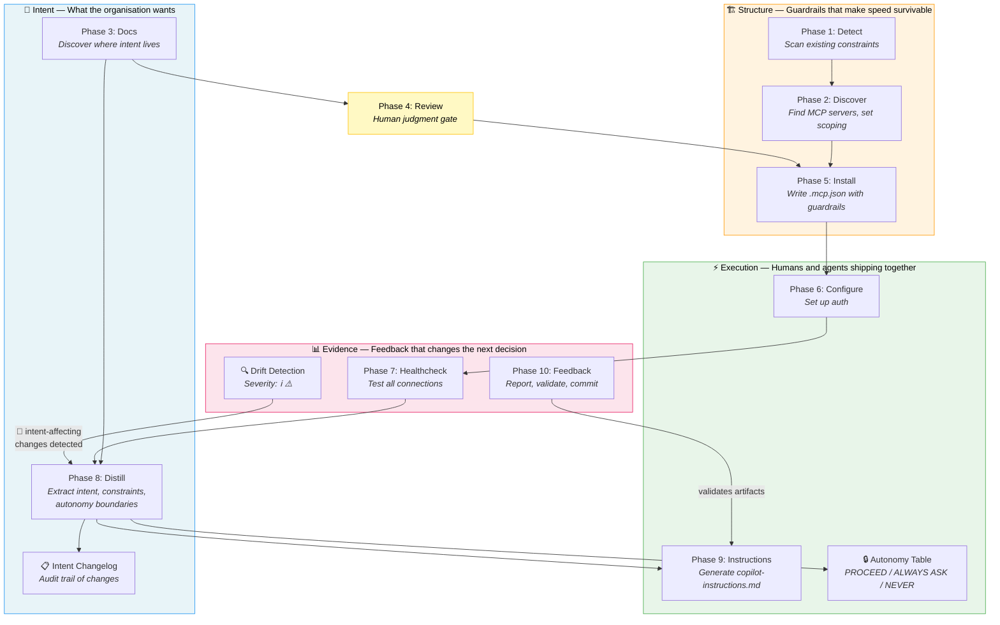

# 🧙 Ape Context

> Enterprise context setup wizard for GitHub Copilot

### Ape Context

**Ape Context** is a Copilot agent that onboards your project into the AI-assisted development workflow. It scans your codebase, discovers the right MCP servers for your toolchain, configures them, generates Copilot instructions, and sets up authentication — all through a guided, interactive wizard. You go through the wizard to set enterprise context up for your team once, then distribute it.

### Git-Ape — a framework for Agentic Platform Engineering
**Ape Context** can be used as a plugin for [**Azure/git-ape**](https://github.com/Azure/git-ape) — a platform engineering framework built on GitHub Copilot that plans, validates, and deploys your infrastructure. Git-Ape uses Ape Context to set up the enterprise context layer (MCP servers, instructions, documentation sources) that its deployment agents rely on.

Ape Context also works standalone — drop the `.github/` folder into any repo and run the wizard without Git-Ape.

## ISEE Framework Alignment

Ape Context implements the [ISEE framework](https://agentile.org) — the structural backbone of the Agentile operating model. Each wizard phase maps to one or more ISEE layers, ensuring that AI-assisted development runs inside structure, not around it.



## Quick Start

### Option 1: Install as GitHub Copilot Plugin

```bash
copilot plugin marketplace add suuus/ape-context
copilot plugin install ape-context@ape-context
```

### Option 2: Copy into your repo

```bash
# Clone this repo
git clone https://github.com/suuus/ape-context.git

# Copy the .github folder into your project
cp -r ape-context/.github/ /path/to/your-repo/.github/
```

### Option 3: Use as a Git submodule

```bash
cd your-repo
git submodule add https://github.com/suuus/ape-context.git .ape-context
# Then symlink or copy what you need into .github/
```

### Then just ask Copilot:

```
@context-wizard Set up my project
```

## What It Does

The wizard runs **10 phases** in order, each backed by a dedicated skill and mapped to the [ISEE framework](https://agentile.org):

| # | Phase | Skill | ISEE Layer | What Happens |
|---|-------|-------|------------|-------------|
| 1 | **Detect** | `context-detect` | Structure | Scans package files, CI/CD, infra, `.mcp.json`, git history |
| 2 | **Discover** | `context-discover` | Structure | Finds MCP servers with tool scoping (read vs write) |
| 3 | **Docs** | `context-docs` | Intent | Discovers where knowledge, intent, and constraints live |
| 4 | **Review** | `context-review` | — | Presents the full setup plan for your confirmation |
| 5 | **Install** | `context-install` | Structure | Writes MCP server configs to `.mcp.json` with scoping |
| 6 | **Configure** | `context-configure` | Execution | Guides auth setup for each MCP server |
| 7 | **Healthcheck** | `context-healthcheck` | Evidence | Tests all MCP connections before using them |
| 8 | **Distill** | `context-distill` | Intent | Analyzes docs to extract intent, constraints, autonomy boundaries |
| 9 | **Instructions** | `context-instructions` | Execution | Generates instructions with enterprise context and distilled intent |
| 10 | **Feedback** | `context-feedback` | Evidence | Setup report, follow-up scheduling, commit offer |

## What Gets Created

After a full run:

- **`.mcp.json`** — MCP server configurations with appropriate tool scoping
- **`.github/copilot-instructions.md`** — Enterprise context with per-tool instructions, cross-tool workflows, distilled intent and constraints
- **`.github/context-report.md`** — Setup report with configuration summary and healthcheck results
- **`.github/intent-changelog.md`** — Audit trail of intent statement changes with timestamps and triggers

## Progress Tracking

The agent uses the **built-in todo mechanism** (SQL `todos` table) for real-time progress tracking. At startup it creates all 10 todos with dependencies:

```
☐ Phase 1:  Detect project stack
☐ Phase 2:  Discover MCP servers
☐ Phase 3:  Discover documentation & intent sources
☐ Phase 4:  Review setup plan
☐ Phase 5:  Install MCP servers
☐ Phase 6:  Configure auth
☐ Phase 7:  Healthcheck connections
☐ Phase 8:  Distill intent & constraints
☐ Phase 9:  Generate Copilot instructions
☐ Phase 10: Feedback & follow-up
```

This works natively in **VS Code**, **GitHub.com**, and **Copilot CLI** — the todo panel shows progress as each phase completes.

## Using Skills Individually

Each skill can be invoked on its own without running the full wizard. Skills check the session store for prior phase output and fall back gracefully — running lightweight inline detection, asking the user directly, or noting what's missing — so standalone invocations never fail silently.

```
/context-detect          # Just scan the project
/context-discover        # Just find MCP servers for your stack
/context-docs            # Just identify documentation sources
/context-install         # Just write .mcp.json
/context-instructions    # Just generate copilot-instructions.md
/context-healthcheck     # Test all MCP connections
/context-distill         # Analyze docs for intent & constraints
/context-history         # Analyze Copilot session history for patterns (asks consent first)
/context-drift           # Check for configuration drift
```

## MCP Server Discovery

The wizard searches for MCP servers in this priority order:

| Source | Badge | Example |
|--------|-------|---------|
| GitHub / Official MCP catalog | 🐙 | `github-mcp-server`, `playwright` |
| Organization catalog (`{org}/.github/mcp-catalog.json`) | 🏢 | Org-approved servers |
| Vendor documentation | 🔰 | Official vendor MCP servers |
| Community | 👥 | Community-built servers |

### Known MCP Server Coverage

| Server | Covers |
|--------|--------|
| `github-mcp-server` | GitHub Issues, PRs, code search, Actions |
| `workiq` | Microsoft 365 (SharePoint, Outlook, OneDrive, Teams) — read-only |
| `playwright` | Browser automation, E2E testing |
| `atlassian-mcp-server` | Jira, Confluence |
| `datadog-mcp-server` | Monitoring, logs, metrics |
| `azure-mcp-server` | Azure resources, deployments |

The wizard automatically detects already-installed servers and won't duplicate them.

## Repository Structure

```
.github/
├── agents/
│   └── context-wizard.agent.md       # Main orchestrator agent (10 phases)
└── skills/
    ├── context-detect/SKILL.md        # Phase 1: Scan project stack
    ├── context-discover/SKILL.md      # Phase 2: Find MCP servers (with tool scoping)
    ├── context-docs/SKILL.md          # Phase 3: Discover docs & intent sources
    ├── context-review/SKILL.md        # Phase 4: Review plan
    ├── context-install/SKILL.md       # Phase 5: Write .mcp.json (with scoping)
    ├── context-configure/SKILL.md     # Phase 6: Auth setup
    ├── context-healthcheck/SKILL.md   # Phase 7: Test connections
    ├── context-distill/SKILL.md       # Phase 8: Extract intent & constraints
    ├── context-history/SKILL.md       # Standalone: Analyze session history
    ├── context-instructions/SKILL.md  # Phase 9: Generate instructions
    ├── context-feedback/SKILL.md      # Phase 10: Report & follow-up
    └── context-drift/SKILL.md         # Standalone: Detect config drift
```

## Customization

| What | How |
|------|-----|
| Add tools to discovery | Edit `context-discover/SKILL.md` — add vendor-specific MCP servers |
| Change doc categories | Edit `context-docs/SKILL.md` — match your org's knowledge structure |
| Org catalog | Create `{org}/.github/mcp-catalog.json` with approved/blocked server lists |
| Custom phases | Add a new skill under `.github/skills/` and reference it in the agent |

## Security

- Credentials are **never stored directly** — the wizard only configures where they go (env vars, `.env`, Key Vault, etc.)
- `.env` files are always added to `.gitignore` before writing
- The wizard **never pushes to remote** without explicit user permission
- All tool selections go through user confirmation before installation
- **Session history analysis requires explicit consent** — `context-history` presents a permission gate explaining what data is accessed, how, and why before running any queries. Declining stops the skill immediately.

## Requirements

- GitHub Copilot with agent/skill support (VS Code, GitHub.com, or Copilot CLI)
- No additional dependencies — the agent and skills are pure markdown prompts

### Interactive Forms

The wizard uses `ask_user` with structured form schemas throughout the onboarding flow. When the **experimental forms feature** is enabled in your Copilot client, tool selection questions render as multi-select checkboxes — making it easy to pick multiple tools per category. When forms are off, the same questions fall back to conversational text-based selection. No configuration needed — the skills use the same schema either way.

### 🧭 Intent — *What the organisation actually wants*

The wizard discovers and codifies organisational intent so that both humans and agents can act on it:

- **Phase 3 (Docs)** discovers where intent lives — ADRs, security policies, product docs, processes — and tags each source by content type (`[intent]`, `[constraint]`, `[process]`, `[reference]`)
- **Phase 8 (Distill)** analyzes those sources via working MCP connections to extract intent statements, constraints, autonomy boundaries, and team topology
- **Phase 4 (Review)** is the human judgment checkpoint where the user explicitly confirms what gets configured

### 🏗️ Structure — *Guardrails that make speed survivable*

The wizard builds the constraints and codified trade-offs that decisions run inside:

- **Phase 1 (Detect)** reads existing constraints — CI/CD pipelines, cloud platform, existing MCP config
- **Phase 2 (Discover)** enforces org catalog policies — approved/blocked server lists, trust badges (🐙🏢🔰👥) — and asks about tool scoping (read-only vs read+write)
- **Phase 5 (Install)** applies structural invariants (`"type": "local"`) and tool scoping to every MCP entry
- **Phase 6 (Configure)** enforces credential governance — secrets never stored directly, `.env` always gitignored, org credential-storage policy respected
- **Phase 8 (Distill)** classifies autonomy boundaries as `PROCEED` / `ALWAYS ASK` / `NEVER` — making agent permissions explicit, not implicit
- **State persistence** — each wizard phase writes its output to the session store, so downstream phases and standalone skills can retrieve scoping decisions, detected stack, and distilled intent reliably

Structure lives in `.mcp.json` (what agents *can* access) and `copilot-instructions.md` (how agents *should* behave).

### ⚡ Execution — *Humans and agents shipping together as cells*

The wizard wires up the execution layer and demonstrates the cell model itself:

- **Phase 5 (Install)** connects agents to external systems — Jira, GitHub, M365, Azure
- **Phase 6 (Configure)** makes connections work by setting up auth
- **Phase 9 (Instructions)** defines execution paths as cross-tool workflows, enriched with distilled intent and constraints
- **Autonomy boundaries** are rendered as a structured table in instructions — agents check their permission level before acting
- **Error handling** is specified for each skill — timeout enforcement, partial pass semantics, consent denial fallbacks, and merge algorithms are explicit, not left to agent judgment
- **Individual skills** are independently invocable (`/context-detect`, `/context-healthcheck`, `/context-drift`, etc.) — cells, not stages
- **context-wizard** orchestrates the cells, but each carries its own context and can run alone

### 📊 Evidence — *Feedback that changes the next decision*

The wizard creates observable signals that flow back upstream:

- **Phase 7 (Healthcheck)** tests every connection — `✅ Connected` or `❌ Auth failed` as immediate feedback, gating Phase 8
- **Phase 10 (Feedback)** generates a setup report (`.github/context-report.md`) and schedules a follow-up check
- **`/context-drift`** (standalone) re-scans the project anytime to detect stack changes vs current config — classifies each finding by severity (`ℹ️ info` / `⚠️ warning` / `🔴 action-required`) and suggests re-distillation when intent-affecting changes are detected
- **Intent changelog** (`.github/intent-changelog.md`) tracks every change to distilled intent statements, constraints, and autonomy boundaries — with timestamps and triggers (initial setup, manual re-distill, drift-triggered)
- **Pre-commit validation** checks all generated artifacts against each other — instructions match `.mcp.json`, autonomy table matches distilled boundaries, report counts are accurate — before offering to commit
- **`/context-history`** (standalone) analyzes Copilot session history to surface what the team *actually does* — complementing docs-based intent with behavioural evidence. Requires explicit user consent before querying.
- **SQL todo tracking** makes progress visible in real time across VS Code, CLI, and GitHub
- **Phase 1 (Detect)** reads existing evidence from git history (commit messages referencing JIRA-123, LINEAR-456) to infer the toolchain

### The two directions of flow

**Downstream (Intent → Execution):** Org policies flow through the org catalog → into `.mcp.json` guardrails → into agent behaviour via instructions.

**Upstream (Evidence → Intent):** Connection tests surface misconfigurations → drift detection classifies severity and flags intent-affecting changes → re-distillation updates constraints → the user confirms revised intent. The intent changelog tracks every change with timestamps and triggers.

Phase 4 (Review) sits at the centre — the point where speed meets human judgment, and where the team owns the choices that matter.

## Contributing

Contributions are welcome! See [CONTRIBUTING.md](CONTRIBUTING.md) for guidelines.

This project follows the [Contributor Covenant Code of Conduct](CODE_OF_CONDUCT.md).

For security vulnerabilities, see [SECURITY.md](SECURITY.md).

## License

MIT — see [LICENSE](LICENSE)
